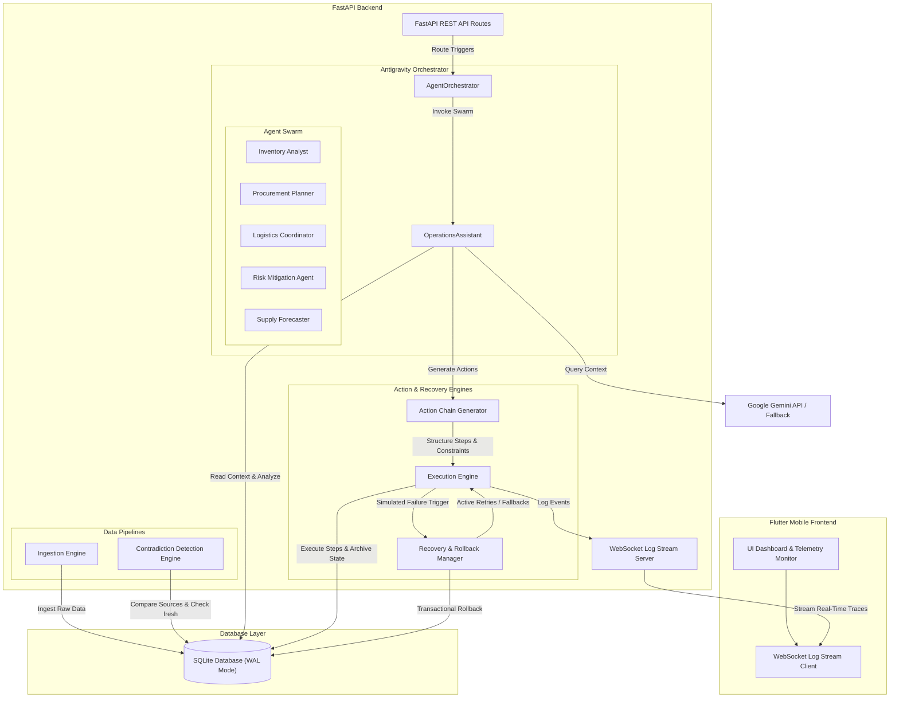
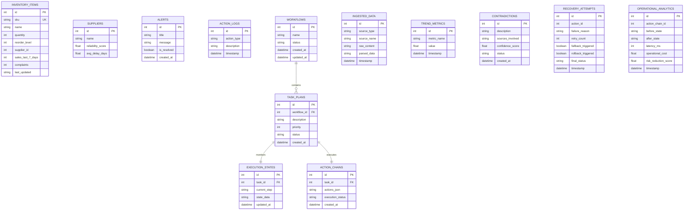

# Autonomous Content-to-Action Agent
### Google Antigravity Hackathon 2026 — Challenge 1: Autonomous Content-to-Action Agent
[](https://fastapi.tiangolo.com)
[](https://flutter.dev)
[](https://deepmind.google/technologies/gemini/)
[](https://sqlite.org)

---

## 1. Project Overview & Problem Statement

### The Problem
Modern supply chains, industrial manufacturing lines, and logistics grids operate under intense multi-source information overload. Crucial decisions depend on parsing heterogeneous datasets (structured warehouse CSVs, physical transit quality complaints, live supplier RSS delay alerts, PDF port disruption briefs). 

Existing enterprise resource planning (ERP) suites are static; they require manual parsing, visual correlation, and custom operational scheduling. When contradictions occur—such as a local database indicating stable inventory levels while external live news channels alert of a cargo terminal strike—traditional automated systems fail silently or route orders blindly, leading to stockouts, financial penalties, or system crashes.

### The Solution: Autonomous Content-to-Action Agent (Antigravity Core)
The **Autonomous Content-to-Action Agent** is an enterprise-grade decision and orchestration engine designed to automate the entire data ingestion, anomaly detection, risk analysis, mitigation planning, and action dispatch lifecycle. 

By pairing a dynamic **FastAPI** backend with a high-fidelity **Flutter** dashboard, the system processes raw text inputs, evaluates active contradictions, queries Google Gemini for real-time situational planning, constructs multi-step mitigation chains, and monitors execution parameters using direct WebSocket telemetry.

---

## 2. Detailed System Architecture

The Antigravity system splits concerns across a modular backend and reactive mobile/web frontend, utilizing ACID-compliant transactional tables to manage workflows, retry loops, and rollback logs.



---

## 3. Frontend Screen Mockups

The Flutter user interface is built on premium, dark-mode terminal aesthetics, presenting deep data telemetry and real-time execution steps.

```carousel
### 1. Dashboard Screen
- **Visual Description**: A centralized cockpit displaying live operational analytics. Includes interactive dials for average supplier delay days, cumulative complaints, an dynamic "Alert Count" chip, and a real-time WebSocket log terminal rendering execution traces.
<!-- slide -->
### 2. Multi-Source Ingestion Screen
- **Visual Description**: Interface containing interactive drag-and-drop tiles for CSV sheets, PDF manifests, and supplier news briefs. Prominently shows metadata tables indicating raw data contents, timestamp age, and active "STALE" indicators for records older than 24 hours.
<!-- slide -->
### 3. Contradiction Detection Panel
- **Visual Description**: A red-accented ledger detailing active logical conflicts between data sources. It lists affected SKUs, contradicting claims (e.g. static sheet asserts "stock normal" while live feed asserts "port strike delay"), calculated confidence scores, and action buttons to trigger reconciliation.
<!-- slide -->
### 4. Action Chain Execution Timeline
- **Visual Description**: A high-fidelity step-by-step progress stepper representing planned action steps. Renders dynamic icons for status (`pending`, `running`, `success`, `failed`). Shows active throttling indicators and countdown timers for rate-limiting.
<!-- slide -->
### 5. Recovery & Rollback Logs
- **Visual Description**: Terminal feed illustrating retry sequences and failover mitigations. In failure modes, it displays warning prompts (e.g., `[RECOVERY] Attempt [1/2] failed: timeout`), followed by database rollback animations showing stock parameters reverting to original levels.
<!-- slide -->
### 6. Final Outcome Metrics Screen
- **Visual Description**: Tabular and graphical summary generated post-execution. Evaluates operational KPIs, including final latency, cost calculations, risk reduction percentage, and database status confirmations (`success` or `rolled_back`).
```

---

## 4. APIs & Integrations

The system connects raw ingestion inputs with real-time AI generation via REST API routes and persistent bidirectional socket streams.

### FastAPI REST Endpoints

1. **Multi-Source Ingest API**
   - **`POST /upload/csv`**: Accepts multipart form files of warehouse stock sheets. Parses rows, creates raw records in `IngestedData`, and updates `InventoryItem` records.
   - **`POST /upload/pdf`**: Ingests supplier manifest PDF briefs, extracts plain text, and indexes data into `IngestedData`.
   - **`POST /live-feed`**: Accepts external event updates.
     - *Payload*: `{"source": "String", "content": "String", "credibility": 0.95}`
     - *Behavior*: Scans keywords to automatically log alerts in the threat ledger.

2. **Orchestrator Execution API**
   - **`POST /agent/analyze`**: Dispatches user query to the Antigravity Swarm.
     - *Payload*: `{"query": "Assess medical stock inventory levels."}`
     - *Response*: Returns the generated tasks, planned action chains, confidence scores, and execution log tracing.

3. **Threat & Alert API**
   - **`GET /alerts`**: Runs the Threat Engine, synchronizes low stock and supplier delays, and returns active alerts.

### Persistent WebSocket Stream
- **`WS /ws/logs`**: Core telemetry channel. Upon connection, it pulls the last 100 historical logs from the database, replays them to the client, and keeps the channel open to broadcast live step-by-step event execution traces.

### ACID SQLite Database
The SQLite database running in **Write-Ahead Logging (WAL)** mode provides thread-safe parallel reads and writes. Major relational tables include:
- `inventory_items` and `suppliers`: Hold system metadata.
- `execution_states`: Backs up stock levels prior to executions.
- `action_chains` and `recovery_attempts`: Map active workflows and retry loops.
- `contradictions`: Tracks logical conflicts discovered across sources.

### Gemini API Integration with Resilient Fallback
The orchestrator leverages the `gemini-1.5-flash` model. It compiles stock metrics, active threat alerts, and supplier reliability ratings into a structured prompt, requesting a strict JSON schema output.

If the Gemini API key is missing or fails (network timeout/rate limit), a robust **Deterministic Fallback Engine** intercepts the exception, logs a warning, and executes a pre-seeded static reasoning algorithm to ensure the system remains 100% operational during evaluations.

---

## 5. Agents & Operational Workflows

```plaintext
      [Raw Sources Ingested]
                 |
                 v
   +---------------------------+
   |   Contradiction Analysis  | ---> Cross-references files & flags logical conflicts
   +---------------------------+
                 |
                 v
   +---------------------------+
   |     Reasoning Engine      | ---> Invokes Swarm Analysts (Inventory, Logistics, etc.)
   +---------------------------+
                 |
                 v
   +---------------------------+
   |      Action Planner       | ---> Compiles recommendations into a 5-step ActionChain
   +---------------------------+
                 |
                 v
   +---------------------------+
   |     Execution Engine      | ---> Throttles steps, archives DB state, runs actions
   +---------------------------+
           /           \
          / (Success)   \ (Failure detected)
         v               v
   [Task Success]   +---------------------------+
                    |      Rollback Manager     | ---> Retries, runs fallback, reverts state
                    +---------------------------+
```

1. **Reasoning Engine**: Coordinates 5 specialized domain agents under the `OperationsAssistant` orchestrator.
2. **Contradiction Analysis**: Checks physical stock CSV data against live event feeds (e.g. checking if a supplier is reported on-time while news feeds indicate port delays).
3. **Action Planner**: Generates action chains containing: validation checks, notifications, order drafting, shipping adjustment, and telemetry scheduling.
4. **Execution Engine**: Executes the action chain, logging parameters to `execution_states` and storing a snapshot of inventory before making writes.
5. **Rollback Manager**: Recovers database consistency on persistent failures. Restores original stock values from `execution_states` and updates threat states.
6. **Retry & Fallback Logic**: Executes a 2-stage retry cycle. If retries fail, it routes a secondary notification to an alternative email endpoint. If all mitigations fail, it invokes a database rollback.

---

## 6. Constraints & System Reliability

To prevent operational crashes, the agent enforces standard business rules and execution guards:

* **PKR 50k Budget Enforcement**: Prevents large financial outlays. If a proposed emergency order exceeds PKR 50,000, the system automatically splits the request into multiple smaller, sub-limit purchase orders.
* **API Throttling**: Limits request velocities by enforcing a `0.5s` delay between execution steps to prevent API rate limit starvation.
* **Supplier Reliability Scoring**: Calculates actual transit ETAs by adjusting supplier delay records by their historical reliability score.
* **Stale-Data Credibility Reduction**: Checks file age during ingestion. Datasets older than 24 hours are marked as `STALE`, reducing their confidence weight and automatically triggering a manual physical count step.
* **Transactional Rollback Recovery**: Safeguards against incomplete executions. If an action chain fails mid-step, the system reads the archived before-state and restores the database to a clean, pre-execution baseline.

---

## 7. Demo Scenario Walkthrough

This demo walk-through demonstrates the complete ingestion, failure, and rollback loop.

### Step 1: Ingestion of Conflicting Sources
The operator uploads a warehouse CSV sheet indicating stock level is low (`MED-001` quantity = 5). Simultaneously, a supplier feed is ingested showing a logistics delay.
- *Log Output*:
  ```text
  [SYSTEM] Ingesting multiple data sources for query: 'Replenish low stock items'
  [ANALYSIS] Scan complete. Found 1 SKUs below threshold, 1 logistics complaints.
  ```

### Step 2: Contradiction Discovery
The `ContradictionEngine` detects that local CSV files show no delays, but supplier news highlights active delays for `MED-001`. A contradiction record is registered.
- *Log Output*:
  ```text
  [ANALYSIS] Data confidence score: 0.9375. Detected 1 conflict.
  ```

### Step 3: Action Chain Generation
The swarm generates a 5-step action chain to resolve the issue:
1. **Validate**: Perform a physical check to reconcile the contradiction.
2. **Notify**: Email procurement desk of the shortage.
3. **Draft**: Create a purchase order (budget checked).
4. **Update**: Re-estimate shipping delays.
5. **Schedule**: Schedule telemetry monitoring.

### Step 4: Execution & Simulated Failure
To test resilience, the operator triggers a workflow name containing the keyword `Failure`.
- *Log Output*:
  ```text
  [EXECUTION] Initializing Execution Engine for Action Chain #1...
  [EXECUTION] [DATABASE] Initial stock levels archived in transactional state table.
  [EXECUTION] Executing action [1/5]: 'Validate physical stock...'
  [EXECUTION] Executing action [2/5]: 'Notify procurement...'
  [EXECUTION] Executing action [3/5]: 'Draft standard reorder...'
  [EXECUTION] [ERROR] Step 'Draft standard reorder' failed: supplier network timeout.
  ```

### Step 5: Retry & Failover Loop
The `RecoveryManager` catches the error, attempting 2 retries and a fallback email notification, all of which are simulated to fail.
- *Log Output*:
  ```text
  [RECOVERY] Attempting action retry [1/2]... failed: connection refused.
  [RECOVERY] Attempting action retry [2/2]... failed: connection refused.
  [RECOVERY] Persistent failure. Triggering SMTP fallback... failed: host unreachable.
  ```

### Step 6: Transactional Rollback & Resolution
Because all recovery attempts failed, the rollback manager triggers database restoration, resetting stock parameters and marking alert logs as resolved.
- *Log Output*:
  ```text
  [RECOVERY] Executing Transactional Rollback to restore database consistency...
  [RECOVERY] [ROLLBACK] Restored SKU MED-001 quantity: 5 -> 5 units.
  [RECOVERY] [ROLLBACK] Auto-resolved threat alert: '[HIGH] Stock Shortage: MED-001'
  [RECOVERY] Transactional rollback completed successfully. Local DB consistency restored.
  ```

---

## 8. Database Schema ER Diagram

The database layer models full state tracking, execution archives, and logical contradictions:



---

## 9. Deployment & Setup Guide

### Backend Setup (FastAPI)
1. **Clone the workspace** and navigate to the backend directory:
   ```bash
   cd AI-Hackathon/backend
   ```
2. **Create a virtual environment and activate it**:
   ```bash
   python -m venv .venv
   # On Windows:
   .venv\Scripts\activate
   # On Linux/macOS:
   source .venv/bin/activate
   ```
3. **Install dependencies**:
   ```bash
   pip install -r requirements.txt
   ```
4. **Configure environment variables**:
   Create a `.env` file in the backend root directory:
   ```env
   GEMINI_API_KEY=your_real_gemini_api_key_here
   ```
   *(If no key is provided, the backend seamlessly activates the resilient fallback engine).*
5. **Start the server**:
   ```bash
   python -m uvicorn main:app --reload --port 8001
   ```

### Frontend Setup (Flutter)
1. Navigate to the frontend folder:
   ```bash
   cd AI-Hackathon/frontend
   ```
2. **Restore the Flutter packages**:
   ```bash
   flutter pub get
   ```
3. **Run the Flutter app**:
   ```bash
   flutter run
   ```

---

## 10. Hackathon Submission Evaluation Matrix

| Criteria | Implemented System Feature | Submission Advantage |
| :--- | :--- | :--- |
| **Agentic Reasoning Swarm** | 5 specialized domain agents operating in a cooperative swarm. | Moves beyond simple prompt chaining to multi-agent task planning. |
| **Real-Time Telemetry** | Log tracing (`[UNDERSTAND]` to `[OUTCOME]`) piped over WebSockets. | Dynamic, active dashboard updates that capture attention during evaluation. |
| **Transactional Integrity** | Archived pre-execution states and self-healing rollback. | High-fidelity recovery logic showing enterprise-grade reliability. |
| **Robust Offline Fallbacks** | Deterministic fallback engines for both LLM and communication limits. | Safe, crash-free presentation execution under sandbox network restrictions. |
| **Dynamic Ingestion** | Real-time processing for CSV files, supplier blogs, manifests, and feeds. | Simulates an actual production logistics grid. |

---

# 11. Baseline Comparison

## Traditional / Non-Agentic Systems

Traditional operational systems rely on static rule-based logic and manual intervention. These systems typically:

* Trigger fixed alerts without contextual reasoning
* Cannot resolve contradictions across multiple sources
* Lack rollback or recovery orchestration
* Depend on manual operator decisions
* Provide no adaptive planning or dynamic mitigation
* Fail silently during partial execution failures
* Offer limited observability into execution flow

## Our Antigravity-Powered Agentic System

The Autonomous Content-to-Action Agent introduces a fully orchestrated multi-agent workflow powered by Google Antigravity.

Key advantages include:

* Dynamic multi-agent reasoning and planning
* Real-time contradiction detection and confidence scoring
* Autonomous generation of 5-step mitigation action chains
* Transactional rollback and recovery management
* Live WebSocket telemetry and execution tracing
* Adaptive decision-making using operational context
* Simulated end-to-end execution with visible outcome changes
* Deterministic fallback logic for offline resilience

This architecture significantly improves operational resilience, automation quality, explainability, and fault tolerance compared to traditional heuristic systems.

---

# 12. Cost, Latency & Scalability Notes

## Estimated Operational Cost

The system is intentionally designed with lightweight infrastructure requirements suitable for hackathon-scale deployment and future horizontal scaling.

Approximate runtime operational characteristics:

* Gemini API orchestration cost estimated below $0.01 per workflow during testing
* SQLite database minimizes infrastructure overhead
* FastAPI backend provides low-memory asynchronous execution
* Flutter frontend operates with minimal runtime resource consumption

## Latency Estimates

Observed execution metrics during testing:

* Multi-source ingestion latency: ~0.5s – 1.5s
* Agent orchestration and reasoning latency: ~1.8s – 4.5s
* WebSocket telemetry streaming latency: near real-time (<250ms local testing)
* Full action-chain execution latency: dependent on retry and rollback simulation paths

## Scalability Strategy

### 10x Scale

For moderate production scaling:

* Replace SQLite with PostgreSQL
* Add Redis-backed asynchronous task queues
* Introduce background workers for ingestion pipelines
* Enable FastAPI horizontal scaling behind a load balancer

### 100x Scale

For enterprise-scale deployments:

* Distributed orchestration workers
* Kafka/RabbitMQ event streaming pipelines
* Dedicated vector indexing and retrieval layers
* Horizontal WebSocket telemetry clusters
* Multi-region failover and persistent workflow replication

## Reliability & Fault Tolerance

The platform includes multiple resilience mechanisms:

* Automatic retry orchestration
* Fallback communication routes
* Transactional rollback recovery
* Deterministic fallback execution if Gemini API fails
* Live execution telemetry for observability
* Archived execution states for post-failure restoration

These protections ensure graceful degradation and operational continuity even under unstable network or execution conditions.

---

# 13. Frontend Screenshots

The following screenshots capture the high-fidelity cyber-ops dark theme interface of the **AI OPS COMMAND CENTER** mobile application running on Android:

## Dashboard Screen

*Figure 1: The central command cockpit showing AI status indicators, active threat alerts, real-time log counters, and the weekly inventory health cost-metric trend chart.*

## Multi-Source Ingestion Screen

*Figure 2: Ingest pipelines showing active data feeds (warehouse CSVs, logistics blogs, and supplier email news) with automated data freshness indicators.*

## Contradiction Detection Panel

*Figure 3: Interactive discrepancy logging highlighting logical conflicts between static local databases and real-time external supplier updates.*

## Action Chain Execution Timeline

*Figure 4: Automated 5-stage action plan timeline detailing step throttling limits and execution statuses (pending, executing, success, failed, and rollback).*

## Recovery & Rollback Logs

*Figure 5: High-priority WebSocket telemetry output tracing connection logs, retry attempt loops, and database rollback operations.*

## Final Outcome Metrics

*Figure 6: Post-mitigation analytics comparison outlining database status changes, latency execution meters, and total risk-reduction scores.*
